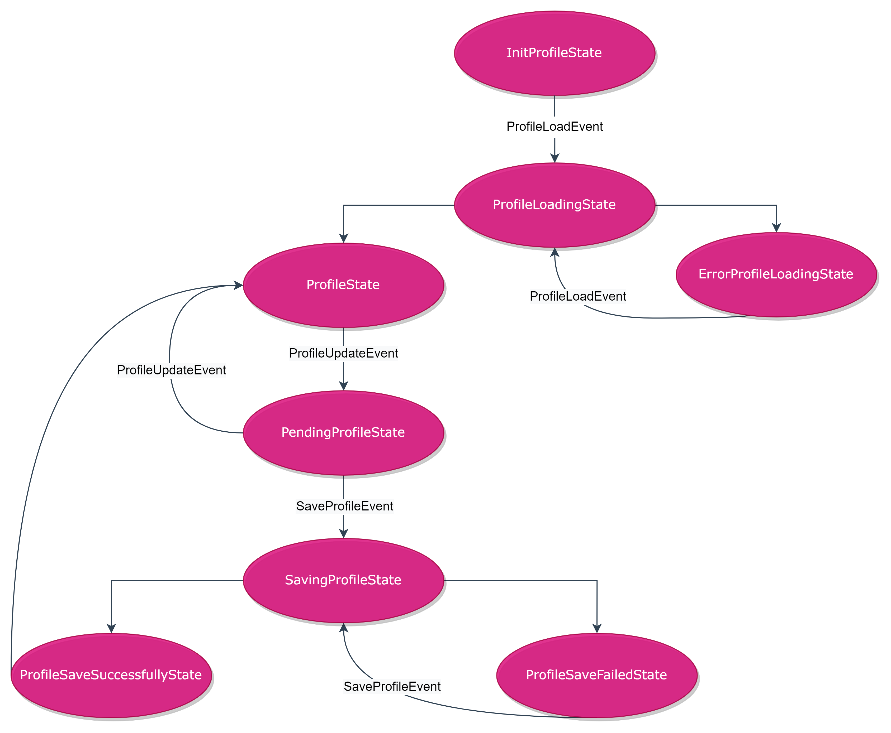

# Profile

Example of using [Elementary](https://pub.dev/packages/elementary) with [Bloc](https://pub.dev/packages/bloc).

This example implements the process of filling out a profile, saving it on the server, and the ability to edit an already completed profile.

### [Bloc](https://pub.dev/packages/bloc) is used to track the state of a profile:

  - **InitProfileState** - no profile state, the profile has not yet been loaded from the server.

  - **ProfileLoadingState** - profile load state from the server.

  - **ErrorProfileLoadingState** - state of the profile loading error from the server.

  - **ProfileState** - the state in which the profile is loaded (it can be filled or empty).

  - **PendingProfileState** - a state in which the profile has been edited but not yet saved.

  - **SavingProfileState** - the state of saving the profile on the server.

  - **ProfileSavedSuccessfullyState** - state of successful saving of the profile on the server.

  - **ProfileSaveFailedState** - error state of saving the profile on the server.

### Bloc diagram

### UI implemented with [Elementary](https://pub.dev/packages/elementary). 

Screens are expands of [ElementaryWidget](https://pub.dev/packages/elementary#widget), they declare how the interface 
should look like.
The [WidgetModels](https://pub.dev/packages/elementary#widgetmodel) of these screens are responsible for the business 
logic of the display, supply the necessary controllers and respond to their changes.
[Models](https://pub.dev/packages/elementary#model) provide relate with the block and repositories (where necessary).

Widgets [CancelButton](lib/features/profile/widgets/cancel_button/cancel_button.dart) and [FieldWithSuggestionsWidget](lib/features/profile/screens/place_residence/widgets/field_with_suggestions_widget.dart)
is also implemented using [Elementary](https://pub.dev/packages/elementary). They have their own logic of work, regardless of where they are used.
CancelButton is used several times. FieldWithSuggestionsWidget rendered separately so that the [WidgetModel](lib/features/profile/screens/place_residence/place_residence_screen_widget_model.dart) of the [PlaceResidenceScreen](lib/features/profile/screens/place_residence/place_residence_screen.dart) does not grow. This widget can also be reused.